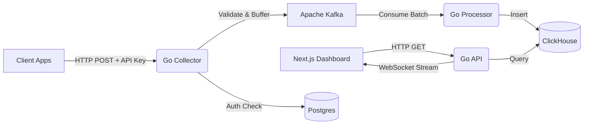

# 🚀 LogStream - Distributed Log Aggregation Platform

LogStream is a high-performance, real-time observability platform designed to handle high-throughput log ingestion, processing, and visualization. Built with scalability and modern engineering practices in mind.


*(Note: You can add a screenshot here later)*

## 🌟 Key Features

- **⚡ Real-Time Streaming:** Watch logs arrive instantly via WebSockets (Matrix-style).
- **🛡️ Secure Ingestion:** API Key authentication middleware ensuring only authorized apps can send logs.
- **📊 Visual Analytics:** Interactive charts for log volume, error rates, and service distribution.
- **🔍 Full-Text Search:** Powered by ClickHouse for sub-second filtering across millions of logs.
- **🚨 Alerting System:** Configure rules to get notified about spikes in errors or traffic.
- **🏗️ Microservices Ready:** Designed to aggregate logs from distributed systems (Python, Node, Go, etc.).

## 🛠️ Tech Stack

- **Backend:** Go (Golang) - High-concurrency ingestion and API.
- **Message Queue:** Apache Kafka - Decouples ingestion from processing for backpressure handling.
- **Database:** ClickHouse - Columnar database for blazing-fast analytical queries.
- **Auth Database:** PostgreSQL (Prisma) - User management and API Keys.
- **Frontend:** Next.js 14, Tailwind CSS, shadcn/ui, Recharts.
- **Communication:** HTTP (Ingest), WebSockets (Stream), gRPC (Internal - optional).

## 🏗️ Architecture



## 🚀 Getting Started

### Prerequisites
- Docker & Docker Compose
- Go 1.21+
- Node.js 18+

### 1. Start Infrastructure
Spin up Kafka, ClickHouse, Zookeeper, and Postgres:
```bash
docker-compose up -d
```

### 2. Build & Run Backend
Compile the Collector and API services:
```bash
# Build binaries
cd api && go build -o ../bin/api .
cd ../collector && go build -o ../bin/collector .

# Run Collector (Port 8080)
./bin/collector

# Run API (Port 8081)
./bin/api
```

### 3. Run Frontend
Start the Next.js dashboard:
```bash
cd web
npm install
npm run dev
```
Visit **http://localhost:3000** to see the dashboard.

## 🔑 Usage

1.  **Sign Up:** Create an account on the dashboard.
2.  **Generate Key:** Go to the "API Keys" section and create a new ingestion key.
3.  **Send Logs:** Use the key to send logs from your applications.

### Example (cURL)
```bash
curl -X POST http://localhost:8080/ingest \
  -H "Authorization: Bearer <YOUR_API_KEY>" \
  -H "Content-Type: application/json" \
  -d '{"service":"payment-api", "level":"error", "message":"Transaction failed"}'
```

See [INTEGRATION_GUIDE.md](./INTEGRATION_GUIDE.md) for Python, Node.js, and Go examples.

## 🤝 Contributing
Contributions are welcome! Please feel free to submit a Pull Request.

## 📄 License
MIT
